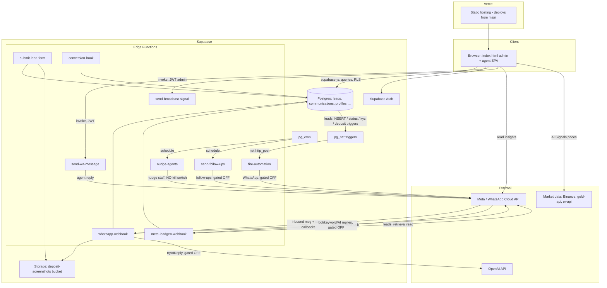
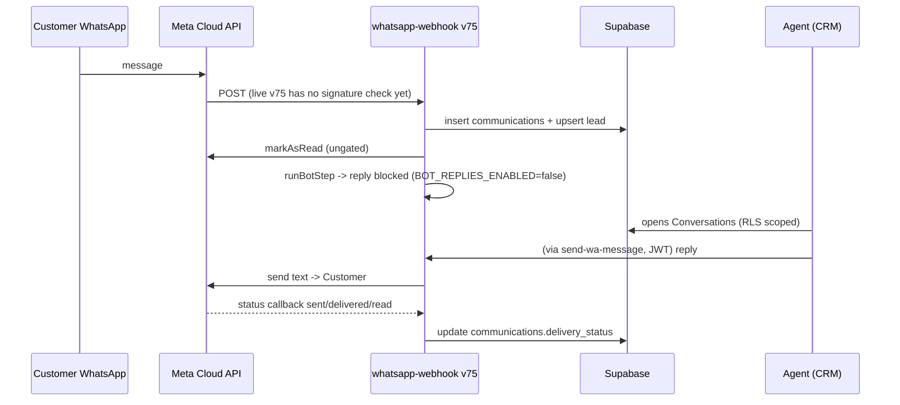

# Badar Trader CRM Project Blueprint

_Evidence-based inspection produced 2026-08-06. Read-only audit: nothing was
deployed, committed, sent, or mutated. Every claim is grounded in repository code,
committed schema, or safe read-only Supabase CLI metadata. Anything that could not
be proven from those sources is marked UNVERIFIED with the reason._

_Progress Board below refreshed 2026-08-17, on top of PR #19 (merged to `main`
2026-08-15), PR #16's restore-rehearsal clearance, and PR #18's browser-QA
clearance. The board is the at-a-glance layer; sections 1-20 are the evidence
behind it. When they disagree, trust the board's date and re-check the code._

---

## Progress Board - live status (updated 2026-08-17)

The one-screen answer to "what is done and what is left", grouped by what each item
is actually waiting on - so nothing sits here looking unfinished when it is really
waiting on a single deploy or a Meta approval. Legend: **LIVE** = working on real
data now; **READY, WAITING** = built and verified in code, one named action from
live; **TO BUILD** = safe code work, no live send; **BLOCKED (human/3rd-party)**;
**OFF BY DESIGN**.

### A. LIVE - working on real data now

| Area | Notes |
| --- | --- |
| Lead pipeline (All/My Leads, Add Lead, CSV import) | Full CRUD, RLS-scoped. All Leads filter bar rebuilt 2026-08-21: result count, per-filter chips, filter-aware empty state, Unassigned and date-added filters, and Export CSV now matching the visible rows |
| Lead detail (profile, ledger, KYC, activity, comms) | Live |
| Omnichannel Inbox / Conversations | Real threads, 24h window timer, contact panel, agent assignment, realtime, agent replies via `send-wa-message`. QA-passed 2026-08-07 |
| 24-hour window countdown pill (C2) | Live; shows agents the window closing |
| Forward a message - to a conversation, and to a teammate | Both shipped (frontend). Teammate forward is a passive `lead_activity` note |
| In-conversation search, day-divider pills | Shipped, demo-verified |
| WhatsApp inbound ingestion + lead creation | Deployed webhook v74 |
| Delivery ticks (B3/B4) | Deployed to `whatsapp-webhook` v73 2026-08-07 (Muhammad's laptop, `--no-verify-jwt`). Column + on-screen ticks + status-callback writer all live; rendering verified firsthand. **Live but not yet proven against a real message - see the routing blocker below** |
| Inbound media stored + playable (voice note / PDF / video downloaded and openable, not just labelled) | Deployed to `whatsapp-webhook` v74 2026-08-07, with a 20MB guard. **Live but not yet tested against a real file - routing blocker below** |
| Agent attachment sending (JPG/PNG/PDF) | Live - confirmed present in the deployed `send-wa-message` (carried in by the bot-takeover deploy; verified by downloading the live function). **Not yet tested with a real send - routing blocker below** |
| Box 3 bot-flow restructure (new-or-existing account question) | Migration applied + `whatsapp-webhook` deployed 2026-08-08 (Muhammad's laptop, `--no-verify-jwt`). Confirmed live via `supabase functions list`: **v75, ACTIVE, updated 2026-08-08 07:50**. **Deploy proven; not yet tested with a real "Start Trading" message - routing blocker below** |
| Mark a conversation unread from the inbox | LIVE - no migration, no deploy needed (`leads.is_unread` already exists); 📩 button in the chat header |
| `converted_at` reporting fix | `saveLeadDetail` + `agentSaveStatus` now stamp `converted_at` when a lead first moves to Converted (was only `approveConversion`). Frontend, demo-verified 2026-08-08, ships on push |
| Schema drift closed in `schema.sql` | Added `communication_logs` table + missing `leads` columns (`deposit_platform/amount/account_ref`, `verified`, `converted_at`, `bot_stage_history`) as Phase 29, reconstructed from the code that writes them. Repo-only (a rebuild from schema.sql is no longer broken); the live DB already has these, so nothing to apply |
| `send-wa-message` bot-takeover-flag fix | DEPLOYED 2026-08-07 (Muhammad's laptop), byte-identical to source |
| Reports (stat cards, agent perf, source, monthly trend, financial summary) | Live via RPCs. QA-passed 2026-08-07 |
| Payroll persistence | Live DB tables + admin-only RLS applied 2026-08-09. Reads period-filtered deposits, saves salary settings and immutable run snapshots, reopens history, exports CSV. Chrome demo verified desktop + 375px mobile, zero console errors |
| Subscribers, Appointments, Meta Ads read-only analytics | Live |
| Focus dashboard + Bot Manager copy fix (PR [#19](https://github.com/claritydigital786/badar-trader-crm/pull/19)) | Merged 2026-08-15 (`db587eb`, merge `4874a2a`), on `main`. Three `index.html` copy lines: "New Broadcast" tile relabelled "Broadcast Review - Parked, sending disabled", "Connect Channel" tile relabelled "Meta Integration", and the Follow-up Sequences info-box corrected to say the production database currently has no cron job (not just `FOLLOW_UPS_ENABLED=false`) - narrower and more honest than the previous claim that a schedule was already firing every 30 minutes. Ships via Vercel's auto-deploy from `main`; not independently re-verified in production during this doc pass |

**Live but not yet proven with a real message.** Four deploys (delivery ticks v73,
inbound media v74, attachment sending, and the Box 3 restructure 2026-08-08) are all
live, but none has been exercised by a real WhatsApp message yet.

**HARD RULE on the two numbers (Muhammad, direct, 2026-08-08):**
- **3903 - NEVER touch it.** It is WhatChimp's / live traffic. No sends, no tests,
  no operations involving 3903, ever, from any session or laptop.
- **6541 - the number dedicated to this Supabase CRM.** All real-message testing
  (Box 3, delivery ticks, media, attachments) goes through **6541 only**.

**FINDING 2026-08-08 - 6541 is NOT clean; WhatChimp is still replying on it.** Muhammad
sent "Hello" + a voice note to 6541 from his personal phone. 6541 auto-replied "We're
seeing an API key error. We've forwarded your query to the concerned department..." -
which is NOT our bot's copy and cannot be us (our replies are gated off). That is an AI
assistant, almost certainly **WhatChimp still live on 6541**. So the earlier
"6541 is dedicated to the CRM, routing settled" is contradicted by evidence: the
WhatChimp double-subscription on 6541 appears UNRESOLVED. Hard consequence: **do NOT
enable `BOT_REPLIES_ENABLED` on 6541** - real customers would get two bots answering.
Whether OUR webhook also receives 6541's inbound is still unconfirmed (check the CRM
inbox for the 0632 conversation, and Meta App Dashboard -> WhatsApp -> Configuration ->
Webhook for the subscribed callback URL). Separately: WhatChimp's AI agent is erroring
on an API key while answering real customers on 6541 - a live WhatChimp issue for
Muhammad to fix in WhatChimp (Claude does not operate WhatChimp).

So the four deploys remain UNPROVEN against a real message, and the routing question is
re-opened by this finding. The next move is for someone to actually send through 6541
(e.g. tap "Start Trading") and confirm the behaviour - on Muhammad's laptop, him
present, since it is live traffic.

### B. READY, WAITING - built and verified, one action from live

| Item | What is left | Whose action |
| --- | --- | --- |
| Disposable local staging and full CRM QA | PR [#14](https://github.com/claritydigital786/badar-trader-crm/pull/14) was reviewed and merged on 2026-08-10 at merge commit `2013d81`. The outbound-safe preparer, assigned-lead and assigned-appointment RLS corrections, actor-audit protections, fake-data matrix, browser evidence, and mobile evidence are now part of `main` | Complete |
| Send an approved template from the inbox | Frontend + `template` branch in `send-wa-message` built, deliberately one commit behind live (can't send until Meta approves a template anyway). Deploy when a template is approved | Deploy `send-wa-message` + Meta approval |
| Meta webhook signature protection | Both public webhook handlers now share exact-byte HMAC-SHA256 verification and dependency-free tests pass. Production remains unchanged until the staged rollout. PR [#18](https://github.com/claritydigital786/badar-trader-crm/pull/18) (below) carries a newer version of this same rollout - decide which is authoritative before doing either twice | Muhammad - deploy both with `--no-verify-jwt`, set `META_APP_SECRET` in audit mode, confirm real `signature valid` logs, then set `META_SIGNATURE_ENFORCED=true` |
| Supabase backup script (4x/day to Hostinger) | Files uploaded to Hostinger (`orange-moose-457260.hostingersite.com`, account root, not `public_html`) and all 4 cron jobs created (`0 0/6/12/18 * * *`). Only `config.php` (real project URL + service role key) is left, and only Muhammad can create it | Muhammad - create `config.php` |
| PR [#16](https://github.com/claritydigital786/badar-trader-crm/pull/16) - safe backup restore verification | Draft since 2026-08-09: ZIP-traversal defenses, checksum verification, secret-stripping, disposable-staging-only apply gate for the Hostinger backups. Restore rehearsal CLEARED 2026-08-17 against a local disposable Supabase staging (colima) - full apply-restore proved across 22 tables, checksums verified, zero production contact | Muhammad - merge decision, since it touches the real backup/restore path for Hostinger credentials |
| PR [#18](https://github.com/claritydigital786/badar-trader-crm/pull/18) - harden CRM staging, correct automation status copy | Draft since 2026-08-14: closes anonymous RPC access to the automation dispatcher, blocks new-user role escalation, removes raw WhatsApp credentials from Agent browsers, adds Meta webhook signature verification (audit + enforcement modes), adds Turnstile + rate limiting to public forms, retires the `nudge-agents` cron schedules. Staging advisor findings drop 23 to 8. Browser QA gate CLEARED 2026-08-17 (isolated worktree, local static server - the branch's own sandbox can't bind a preview port): Dashboard and both Bot Manager sub-tabs render the corrected gate copy, zero console errors, no 375px overflow | Muhammad - merge decision, plus staging-only secret tests (authenticated no-op, wrong-secret, public-form QA against the disposable project) still open per the PR body |

**B3/B4 (Muhammad asked directly) - deployed.** These are the WhatsApp delivery ticks
on messages you send (one grey ✓ = sent, two grey ✓✓ = delivered, two blue = read,
red ! = failed). As of 2026-08-07 all three pieces are live: the DB column was applied,
the on-screen ticks were verified rendering, and `whatsapp-webhook` v73 records each
status callback. The only thing left is proving it with a real message once the
webhook-routing question above is settled.

### C. TO BUILD - safe code work, no live send, can start anytime

No currently listed self-contained code item remains in this bucket. Webhook signature
protection moved to READY, WAITING after local verification on 2026-08-09.

### D. BLOCKED - human or third-party, no Claude session does these

| Item | Blocked on |
| --- | --- |
| Get a WhatsApp template approved by Meta | Meta review. Unblocks template-from-inbox, Follow-ups, and Broadcast Signal |
| Create two Supabase Auth users (Bilal, Faisal) | A human sets a real password |
| Real-message test of the recent deploys + resolve WhatChimp-on-6541 | 2026-08-08 test showed 6541 STILL auto-replies via WhatChimp (see the finding above section B). Confirm whether our webhook also receives 6541 (CRM inbox + Meta App Dashboard webhook config), and resolve WhatChimp's subscription on 6541, before trusting any 6541 test. **3903 is WhatChimp's - never touch it.** Muhammad |
| Meta Lead Ads intake | Meta token needs `leads_retrieval` scope |
| Any bot/keyword/AI reply going live | Muhammad's decision + WhatChimp automation confirmed OFF + flag flip on his laptop |
| Syed Hamza | Stays suspended until Muhammad decides (post-CRM) |
| Confirm live `cron.job` contents | `schema.sql` declares three jobs (two `nudge-agents`, one `send-follow-ups`); PR #19's shipped copy now says production has none scheduled, PR #18 claims to retire the `nudge-agents` ones in staging. Needs a read-only `select jobname, schedule, active from cron.job` from a laptop with production access to settle which of these is currently true |

### E. OFF BY DESIGN - built and deliberately switched off

All seven send flags are `false` in deployed code: `BOT_REPLIES_ENABLED`,
`KEYWORD_REPLIES_ENABLED`, `AI_REPLIES_ENABLED`, `NEW_LEAD_NOTIFICATIONS_ENABLED`,
`FOLLOW_UPS_ENABLED`, `SIGNAL_BROADCAST_ENABLED`, `AUTOMATION_ENABLED`. `nudge-agents`
has no code kill switch and is held back only by not being scheduled. Bot Manager
reference cards and the Notifications / Sites / User Permission pages are intentional
placeholders. AI Signals compute for real but delivery is manual.

**Open questions for Muhammad (not blocking):** (1) the live Reports "Total Revenue /
Approved deposits" card sums every lead's `account_balance` while the Financial
Summary's "Total Deposits" comes from an RPC - these can disagree in live (flagged
2026-08-07). (Two earlier open questions are now resolved: attachment sending is
confirmed live, and the teammate-forward notification was built - though Muhammad has
since parked the in-app notifications work, so it is intentionally off this board;
the code and migration stay in the repo, see REMAINING_TODOS.)

---

## 1. Executive Summary

Badar Trader CRM is a single-page admin and agent CRM for a forex/trading lead
business. The frontend is one large `index.html` (about 9,025 lines of plain
HTML/CSS/JS) talking directly to Supabase (Postgres + Auth + Storage + Edge
Functions), deployed to Vercel from `main`. The backend is nine Supabase Edge
Functions plus a Postgres schema with automation triggers and cron jobs.

What currently works on real data:
- Lead capture and pipeline (All Leads, My Leads, Add Lead, CSV import), lead
  detail with financial ledger / KYC / activity / comms, all RLS-scoped.
- The Omnichannel Inbox (Conversations): real WhatsApp threads, live 24-hour
  window countdown, contact panel, agent assignment, realtime updates, and agent
  replies sent through a server-side proxy.
- WhatsApp inbound ingestion: the deployed webhook logs every inbound message and
  creates/updates leads.
- Reports (Supabase RPCs), Subscribers (real table), Meta Ads read-only analytics.

What is deliberately switched off (kill switches, all verified `false` in code):
`BOT_REPLIES_ENABLED`, `KEYWORD_REPLIES_ENABLED`, `AI_REPLIES_ENABLED`,
`NEW_LEAD_NOTIFICATIONS_ENABLED` (all in `whatsapp-webhook`), `FOLLOW_UPS_ENABLED`,
`SIGNAL_BROADCAST_ENABLED`, `AUTOMATION_ENABLED`. So the bot never replies to a
real customer, no automated follow-ups or broadcasts go out, and automation rules
do not fire sends. Inbound logging still runs.

What is incomplete or placeholder (see the Progress Board for current state; this
paragraph is the 2026-08-06 snapshot): Message Templates (stores text only, does not
submit to Meta - a send path has since been built, see the board),
AI Signals accuracy tracker (no persistence),
Notifications / Sites / User Permission pages (static placeholders), and a large
set of Bot Manager reference cards that are explicitly "not built yet."

Biggest blockers: several are human-only (Meta `leads_retrieval` token scope, Meta
template approval, confirming WhatChimp automation is off, creating two Auth users).

Biggest technical risks in that 2026-08-06 snapshot were schema drift and unsigned
webhooks. Schema drift is now closed in the repo. Webhook signature verification is
built and locally tested, but the live endpoints remain unsigned until Muhammad
completes the staged deploy, audit, and enforcement rollout. The unauthenticated
cron-driven `nudge-agents` send function still has no code-level kill switch, and a
per-row HTTP trigger on `leads` INSERT still makes a bulk import risky.

---

## 2. Verification Snapshot

- Date: 2026-08-06.
- Branch: `main`.
- Commit: `9ed1327` ("docs: drop the duplicated parity to-do line").
- `git pull`: succeeded (fast-forward already up to date, after stashing an
  uncommitted local change and restoring it - see note below).
- Sources inspected: `index.html`, all nine `supabase/functions/*/index.ts`,
  `supabase/schema.sql`, `supabase/migrations/` (25 files), `HANDOFF.md`,
  `REMAINING_TODOS.md`, `supabase/config.toml`, and live deployment metadata via
  `supabase functions list` (safe, read-only).
- Deployment state: VERIFIABLE for Edge Functions (versions and `verify_jwt`
  confirmed via `supabase functions list`). See section 5.
- NOT inspectable from this session:
  - Live Postgres schema and whether migrations were actually applied (no safe SQL
    query path was available; the CLI here exposes function metadata, not arbitrary
    DB reads). Marked UNVERIFIED throughout.
  - Live `cron.job` contents (whether cron jobs are scheduled).
  - Meta app / token scopes (`leads_retrieval`), WhatsApp template approval state.
  - WhatChimp (prohibited by project rules; reference-only, not opened).

Important honesty note about `index.html`: the working tree currently contains an
UNCOMMITTED local change from an earlier session today that adds delivery-tick and
day-divider rendering (`waTicks()`, `renderConvMessages()`). That code is NOT in the
committed repo (`git show HEAD:index.html` has zero matches for it) and NOT
deployed. This blueprint describes the committed/deployed state as the source of
truth and calls out the uncommitted work explicitly where relevant (sections 6, 7,
11). Do not read the presence of those functions in a live editor as "shipped."

---

## 3. Architecture

Only connections supported by code are drawn. The `net.http_post` trigger path and
the two cron paths are defined in `schema.sql`; whether the cron jobs are actually
scheduled live is UNVERIFIED.

Deployment model:
- Frontend: `git push` to `main` -> Vercel auto-deploy (production at
  crm.badartrader.com). Confirmed by repo convention and HANDOFF; not re-tested.
- Edge Functions: deployed separately with the Supabase CLI. Current live versions
  confirmed via `supabase functions list` (section 5).

---

## 4. Database Blueprint

Source of truth for these rows is `supabase/schema.sql` (1,526 lines, "Phases
1-27") plus `supabase/migrations/` (25 files; the `applied_via_sql_editor.sql` ones
are placeholder stamps for changes applied by hand).

| Object | Type | Purpose | Important relationships / side effects | Verification |
| --- | --- | --- | --- | --- |
| `profiles` | table | One row per staff auth user | `role` admin/agent, `is_suspended`, `phone` (staff WhatsApp number read by the agent rotation) | schema.sql:8-23; `phone` in migration `20260806010000_profiles_phone.sql` |
| `leads` | table | Every lead/client (there is no separate clients table) | Bot state (`bot_stage`, `language`, `broker_choice`, `trader_experience`), handoff (`needs_human`, `handoff_reason`, `is_unread`), agent-ping fields, `manual_tier`, financial (`account_balance`, `kyc_status`) | schema.sql:26-43, 526-576, 951-954; `bot_stage_history TEXT[]` only in migration `20260721000000_bot_back_navigation.sql:7` |
| `communications` | table | Per-lead message log (whatsapp/email/call/sms) | `wa_message_id` (correlates status callbacks), `attachment_path`, `delivery_status` | schema.sql:344-353, 689, 935; `delivery_status` in migration `20260806020000_communications_delivery_status.sql` |
| `communication_logs` | table | Manual log lines; written by conversion-hook, submit-lead-form, send-wa-message | NO `CREATE TABLE` in repo (drift, see section 17) | UNVERIFIED - not defined in repo |
| `lead_activity` | table | Per-lead activity (call/whatsapp/email/note) | Written by Log Activity and reassignment traces | schema.sql:46-54 |
| `audit_log` | table | Insert/update/delete audit of leads | Populated by `audit_leads()` trigger | schema.sql:57-66, 124-144 |
| `settings` | table | key/value (WA token, meta_token, openai_api_key, admin number, model) | Read by webhook and frontend; admin-only RLS | schema.sql:69-74 |
| `transactions` | table | Financial ledger (deposit/withdrawal) | INSERT of a deposit fires an automation trigger | schema.sql:249-259, 796-808 |
| `kyc_documents` | table | KYC and deposit-screenshot records | `document_type` includes `deposit_screenshot`; files in `deposit-screenshots` bucket | schema.sql:262-273, 829-831 |
| `automation_rules` | table | Admin-defined automation | `channel` whatsapp/email/sms/assign_agent; consumed by fire-automation | schema.sql:356-367, 727-743 |
| `ai_knowledge_base` | table | "Bot Manager" AI training (system prompt + notes) | Read by `tryAIReply()` only when `AI_REPLIES_ENABLED` | schema.sql:1099-1109 |
| `ai_agents` | table | Bot Manager AI agents (name + prompt, optional kb) | `is_active` default false | migration `20260806000000_ai_agents.sql`; backfilled to schema.sql:1472-1481 |
| `keyword_replies` | table | "Create Flow" keyword -> reply | Read by `tryKeywordReply()` when `KEYWORD_REPLIES_ENABLED` | schema.sql:1115-1125 |
| `follow_up_sequences` | table | Follow-up rules (status + delay -> message) | Read by send-follow-ups when `FOLLOW_UPS_ENABLED` | schema.sql:1173-1184 |
| `follow_up_sends` | table | One row per (lead, sequence), no retry | Idempotency guard for follow-ups | schema.sql:1391-1401 |
| `message_templates` | table | CRM record of template copy + review status | Does NOT submit to Meta | schema.sql:1217+ |
| `subscribers` | table | Signalling-community members (about 4k) | `status` pending/active/inactive/removed, unique on phone; used by broadcast | schema.sql:1266-1280 |
| `appointments` | table | Call scheduling | Deliberately no FK to leads | schema.sql:1315-1329 |
| `signal_broadcasts` | table | One row per broadcast attempt, `results` JSONB | Written by send-broadcast-signal | schema.sql:1423-1439 |
| `signals` | table | Legacy signal records (public read) | Legacy; AI Signals tab does not persist here | schema.sql:484-497 |

Triggers (all confirmed in `schema.sql`):

| Trigger | Table / event | Function | External HTTP? |
| --- | --- | --- | --- |
| `leads_updated_at` | leads BEFORE UPDATE | `set_updated_at()` | No (schema.sql:86-97) |
| `on_auth_user_created` | auth.users AFTER INSERT | `handle_new_user()` creates a profile (default role agent) | No (103-121) |
| `leads_audit` | leads AFTER INS/UPD/DEL | `audit_leads()` writes audit_log | No (124-144) |
| `leads_guard_admin_columns` | leads BEFORE UPDATE | `guard_leads_admin_only_columns()` blocks non-admin edits to money/kyc columns | No (279-295; redefined 851-862 to exempt service_role) |
| `leads_status_changed_at` | leads BEFORE UPDATE | `set_status_changed_at()` | No (1368-1383) |
| `automation_lead_created` | leads AFTER INSERT | `trg_leads_created()` -> `fire_automation_event('lead_created')` | YES -> net.http_post to fire-automation (748-766) |
| `automation_status_changed` | leads AFTER UPDATE OF status | `trg_leads_status_changed()` | YES -> net.http_post (768-780) |
| `automation_kyc_verified` | leads AFTER UPDATE OF kyc_status | `trg_leads_kyc_verified()` | YES -> net.http_post (782-794) |
| `automation_deposit_recorded` | transactions AFTER INSERT | `trg_transactions_deposit()` | YES -> net.http_post (796-808) |
| `*_updated_at` (7 tables) | BEFORE UPDATE | `set_updated_at()` | No |

Whether any of these objects match the live database is UNVERIFIED (no DB read
path). Three of them are known to be missing from the repo entirely (section 17).

---

## 5. Edge Function Inventory

Live versions and JWT posture confirmed 2026-08-06 via `supabase functions list`
(read-only). "Can send" means "can reach a real person or write to Meta."

| Function | Purpose | Called by | Can send externally? | Safety control | Deployment state (verified) |
| --- | --- | --- | --- | --- | --- |
| `whatsapp-webhook` | Inbound ingestion + bot state machine + delivery-status writes + media + escalation | Meta Cloud API (GET verify, POST messages/statuses) | YES - WhatsApp via `callGraphApi` (index.ts:1680), OpenAI (832) | `BOT_REPLIES_ENABLED`, `KEYWORD_REPLIES_ENABLED`, `AI_REPLIES_ENABLED`, `NEW_LEAD_NOTIFICATIONS_ENABLED` (all false); `markAsRead` ungated | v70, ACTIVE, verify_jwt=false |
| `send-wa-message` | Server-side agent reply proxy (keeps token off the browser) | Frontend Conversations via `sb.functions.invoke` | YES (index.ts:131) | No `_ENABLED` flag by design; JWT + admin/active-staff role check | v5, ACTIVE, verify_jwt=true |
| `send-follow-ups` | Turns `follow_up_sequences` into WhatsApp sends | pg_cron (`*/30 4-12 * * *`) via net.http_post | YES (index.ts:48) | `FOLLOW_UPS_ENABLED = false` (checked first) | v3, ACTIVE, verify_jwt=false |
| `send-broadcast-signal` | Individual DMs to active subscribers | Frontend admin via invoke | YES (index.ts:137) | `SIGNAL_BROADCAST_ENABLED = false`; 200/run cap; 300ms pacing; JWT + admin | v3, ACTIVE, verify_jwt=true |
| `fire-automation` | Runs matching automation_rules for an event | DB triggers via net.http_post | YES (index.ts:42) | `AUTOMATION_ENABLED = false` (checked first) | v3, ACTIVE, verify_jwt=false |
| `nudge-agents` | Re-pings assigned agent about unacked leads; escalates to team | pg_cron (2 jobs) via net.http_post | YES to STAFF numbers (index.ts:42) | NONE - no flag, no JWT (see section 10) | v5, ACTIVE, verify_jwt=false |
| `meta-leadgen-webhook` | Receives Meta leadgen, retrieves fields, inserts lead | Meta webhook | No customer send; makes a Graph READ (index.ts:57) | GET verify token; no `_ENABLED` (no send) | v1, ACTIVE, verify_jwt=false |
| `submit-lead-form` | Public form intake + deposit-screenshot upload | signals-form.html / course-form.html | No | Server-side validation; service role | v3, ACTIVE, verify_jwt=false |
| `conversion-hook` | Marks a lead converted from the thank-you page | Public thank-you page via query params | No | None needed (no send); service role | v11, ACTIVE, verify_jwt=false |

---

## 6. Feature Status Matrix

Labels: WORKS ON REAL DATA / BUILT, TESTED, SWITCHED OFF / PARTIALLY IMPLEMENTED /
PLACEHOLDER, MANUAL ONLY / BLOCKED ON HUMAN ACTION / UNKNOWN, UNVERIFIED.

| Feature | Status | Evidence | Production impact | Blocker / missing work |
| --- | --- | --- | --- | --- |
| Lead pipeline (All/My Leads, Add, CSV import) | WORKS ON REAL DATA | index.html:4034, 4147, 4069, 4377 | Live lead data | none |
| Lead detail (profile, ledger, KYC, activity, comms) | WORKS ON REAL DATA | index.html:4459, 4659, 4788, 5011 | Live | none |
| Omnichannel Inbox / Conversations | WORKS ON REAL DATA | renderConversations index.html:7378; send via send-wa-message | Live customer traffic | do not operate real chats (project rule) |
| Agent reply send (server proxy) | WORKS ON REAL DATA | send-wa-message v5, JWT+role | Live sends by authenticated staff | none; no kill switch by design |
| WhatsApp inbound ingestion + lead creation | WORKS ON REAL DATA | whatsapp-webhook v70 | Live logging | none |
| Bot funnel replies (greeting, broker, deposit, etc.) | BUILT, TESTED, SWITCHED OFF | code in whatsapp-webhook; `BOT_REPLIES_ENABLED=false` (line 43); HANDOFF records simulated-webhook tests | None while off | flag flip (human, Muhammad's laptop) + WhatChimp check |
| Keyword replies (Create Flow) | BUILT, TESTED, SWITCHED OFF | `KEYWORD_REPLIES_ENABLED=false` (57); table + UI exist | None while off | flag flip + WhatChimp check |
| AI replies (Bot Manager) | BUILT, TESTED, SWITCHED OFF | `AI_REPLIES_ENABLED=false` (77); OpenAI call gated (832); key + model saved | None while off | flag flip + WhatChimp check |
| Delivery ticks - backend | WORKS ON REAL DATA (writes attempted) | webhook DELIVERY_RANK + `delivery_status` writes (index.ts:506-546), deployed v70 | Writes status if column exists live | migration applied state UNVERIFIED (section 17 risk) |
| Delivery ticks - frontend rendering | PARTIALLY IMPLEMENTED | NOT in committed index.html (git HEAD: 0 matches); uncommitted local work exists this session | None (not shipped) | commit + deploy after migration applied |
| Automation rules engine | BUILT, TESTED, SWITCHED OFF | fire-automation `AUTOMATION_ENABLED=false`; triggers wired | None while off | flag flip; confirm rules intended |
| Follow-up sequences | BUILT, SWITCHED OFF | send-follow-ups `FOLLOW_UPS_ENABLED=false`; cron defined; table + UI | None while off | flag flip; note incident history (39-lead match) |
| Signal broadcast | BUILT, SWITCHED OFF | send-broadcast-signal `SIGNAL_BROADCAST_ENABLED=false`; caps + pacing | None while off | flag flip; Communities cannot be posted via API |
| Subscribers | WORKS ON REAL DATA | `subscribers` table; index.html:8390-8520 | Live | none |
| AI Signals (indicators) | WORKS ON REAL DATA (analysis) but MANUAL delivery | real SMA/RSI/ATR from live/historical prices, deterministic confidence (index.html:8689-8855); no auto-send | Informational only | not automated; delivery is manual |
| AI Signals accuracy tracker | PLACEHOLDER, MANUAL ONLY | `_signalHistory` always empty; honest empty state (index.html:8679, 8954) | None | no outcome/persistence model |
| Message Templates | PLACEHOLDER, MANUAL ONLY | stores body + status; delete says "not anything in Meta" (index.html:6082) | None external | no Meta Template API submission |
| Reports | WORKS ON REAL DATA | RPCs report_* (index.html:6717-6719) | Live | none |
| Meta Ads analytics | WORKS ON REAL DATA (read-only) | Graph insights (index.html:5315-5346) | Read-only | none |
| Meta Lead Ads intake | PARTIALLY IMPLEMENTED / BLOCKED ON HUMAN ACTION | meta-leadgen-webhook v1; token lacks `leads_retrieval` (per code comment) | Real leads not retrieved until scope added | Meta token scope + webhook subscription (human) |
| Payroll | WORKS ON REAL DATA | `payroll_settings` + immutable `payroll_runs`; period-filtered deposit query; saved-run history; CSV export | Live, admin-only RLS | none |
| Appointments | WORKS ON REAL DATA | `appointments` table; index.html:5631 | Live | none |
| Notifications page | PLACEHOLDER, MANUAL ONLY | static; Save fires alert() (index.html:2690) | None | not wired |
| Sites / Landing Pages | PLACEHOLDER, MANUAL ONLY | static links (index.html:2332-2361) | None | not wired |
| User Permission | PLACEHOLDER, MANUAL ONLY | static; "no per-feature toggle yet" (index.html:1520) | None | RBAC not built |
| Bot Manager reference cards (18) | PLACEHOLDER, MANUAL ONLY | BM_PLACEHOLDERS (index.html:3569-3591) | None | not built by design |
| nudge-agents | BUILT, SWITCHED OFF (by not scheduling) | v5 deployed; no flag; cron defined in schema | Would send to staff if cron scheduled | Muhammad does not want it; keep unscheduled |

---

## 7. WhatsApp System

Inbound (verified):
1. Meta Cloud API POSTs to `whatsapp-webhook` (live v75, public, no JWT). GET is gated
   by `WHATSAPP_VERIFY_TOKEN`. The committed next version verifies
   `X-Hub-Signature-256` over the exact request bytes before parsing, but the live
   v75 source still uses `req.json()` and accepts unsigned POSTs until Muhammad
   completes the rollout shown in the Progress Board.
2. The webhook records the inbound message into `communications`, creates/updates
   the `leads` row, downloads any image to the `deposit-screenshots` bucket, and
   marks the message read via `markAsRead` (blue ticks, ungated).
3. It then runs the bot state machine (`runBotStep`), which would send greeting /
   language / broker / experience / deposit / escalation replies - but every send
   funnels through `sendText` / `sendButtons` / `sendList`, all gated by
   `BOT_REPLIES_ENABLED=false`, so nothing is sent to the customer today.

Outbound paths (verified):
- Bot replies: `sendText/sendButtons/sendList` -> `callGraphApi` (index.ts:1680),
  gated by `BOT_REPLIES_ENABLED`.
- Keyword replies: `sendKeywordText` (1561), gated by `KEYWORD_REPLIES_ENABLED`.
- AI replies: `sendAIText` (1574) + OpenAI call (832), gated by `AI_REPLIES_ENABLED`.
- Agent manual reply: `send-wa-message` (v5), JWT + role gated, no kill switch (by
  design - agents must be able to reply).
- Read receipts: `markAsRead` (1664), ungated but not a customer-visible message.

Delivery status callbacks: Meta status entries (`sent/delivered/read/failed`) use a
forward-only rank guard, so a late "delivered" cannot overwrite a "read", and write
`communications.delivery_status`. The webhook writer and frontend ticks are both
live; their remaining gap is a real-message proof after the 6541 routing issue is
resolved.

24-hour window: computed client-side in `waWindowState()` / `startWaWindowTicker()`
(index.html around 7409-7479), shown as a live countdown pill and used to disable
the composer when the window closes. This is real and committed.

Bot/agent handoff: `send-wa-message` and the legacy in-browser fallback both set
`needs_human=true` with a handoff reason when an agent replies, so the bot stops
treating a lead's messages as answers to its own flow. Escalation
(`ESCALATION_NOTIFICATIONS_ENABLED=true`) notifies the assigned agent - BUT that
notification is sent via `sendText`, itself gated by `BOT_REPLIES_ENABLED=false`, so
no escalation message actually goes out today (see section 10).

---

## 8. Meta Lead Ads Flow

Verified from `meta-leadgen-webhook/index.ts`:
1. Meta posts a `leadgen` event to the webhook (GET verify uses
   `META_LEADGEN_VERIFY_TOKEN`, index.ts:81).
2. The function calls the Graph Leads Retrieval API to fetch the submitted field
   data (`fetchLeadFields` -> fetch with `access_token`, index.ts:57).
3. It inserts a `leads` row; that INSERT fires `automation_lead_created` ->
   fire-automation (gated off).

Current blocker (from code comment, index.ts:16-24): the stored `settings.meta_token`
lacks the `leads_retrieval` scope, so step 2 fails. This is a human-only fix (Meta
Business settings). The webhook subscription and Page link are also human steps.
UNVERIFIED: the actual live token scope and subscription state could not be
inspected (would require Meta access, which is prohibited).

Security note: live v3 is not signature-verified, so a crafted `leadgen` body could
insert leads. The committed next version verifies the exact request bytes using the
shared Meta HMAC helper, but that protection is not live until Muhammad completes
the staged rollout. This risk was documented and locally fixed, never exploited.

---

## 9. AI Signals

What it does (verified, index.html:8666-8954): fetches real live prices (Binance for
crypto, gold-api.com for gold via a PAXG proxy, open.er-api.com for FX) and real
historical candles, then computes genuine technical indicators: SMA
(`computeSMA`), RSI (`computeRSI`), and ATR (`computeATR`). The signal direction and
a deterministic confidence percentage are derived from the SMA gap and RSI strength
(index.html:8849). If no rule fires, it honestly returns "no signal" (8843).

What it does NOT do: it is not machine learning or "AI" in any model sense - it is
deterministic technical analysis. The old `Math.random()` confidence has been
removed (the only two `Math.random(` occurrences left in the file are inside
comments). There is no outcome tracking or win-rate model: `_signalHistory` is
always empty and the accuracy tracker renders an honest empty state
(index.html:8679, 8954). FX is daily-close only and gold uses a token proxy, both
disclosed in the output. Delivery to subscribers is manual (it can prefill the
Broadcast Signal form).

Classification: the indicator analysis is WORKS ON REAL DATA; the accuracy/win-rate
tracker is PLACEHOLDER, MANUAL ONLY.

---

## 10. Automation and Safety Controls

| Flag | Current state | Guards (what it blocks) | Definition | Usage sites | Bypass risk |
| --- | --- | --- | --- | --- | --- |
| `BOT_REPLIES_ENABLED` | false | All bot funnel replies + cards + (indirectly) escalation pings | whatsapp-webhook:43 | 1584, 1598, 1624 (via sendText/Buttons/List) | `markAsRead` sends read-receipts ungated (not a message) |
| `KEYWORD_REPLIES_ENABLED` | false | Keyword auto-replies | whatsapp-webhook:57 | 744, 1558 | none found |
| `AI_REPLIES_ENABLED` | false | AI replies + the OpenAI call | whatsapp-webhook:77 | 800, 1571, 832 | none found |
| `NEW_LEAD_NOTIFICATIONS_ENABLED` | false | New-lead agent ping | whatsapp-webhook:34 | 463 | routes through sendButtons (also gated) |
| `ESCALATION_NOTIFICATIONS_ENABLED` | true | Agent escalation ping | whatsapp-webhook:84 | 1241 | NEUTRALIZED: the ping uses `sendText`, gated by BOT_REPLIES_ENABLED, so nothing is actually sent today |
| `AUTOMATION_ENABLED` | false | fire-automation sends | fire-automation:28 | 81 | none; checked before any send |
| `FOLLOW_UPS_ENABLED` | false | send-follow-ups sends | send-follow-ups:26 | 64 | none; checked first |
| `SIGNAL_BROADCAST_ENABLED` | false | broadcast sends | send-broadcast-signal:28 | 76 | none; checked first + JWT admin |

Paths that can send WITHOUT a code-level `_ENABLED` kill switch (the section D
question, "search specifically for any outbound path that could send without going
through the intended kill switches"):
1. `nudge-agents` - no flag and no JWT. Its only controls are (a) whether the two
   pg_cron jobs are scheduled and (b) whether unacknowledged assigned leads exist.
   If the cron is scheduled and credentials are valid, it sends WhatsApp messages to
   STAFF numbers unattended. Recipients are agents/admin, not customers, but this is
   the one autonomous send path with nothing in code to stop it. Muhammad has said he
   does not want agent nudges; the safe control is keeping it unscheduled.
   UNVERIFIED: live cron.job state.
2. `send-wa-message` - no flag, but this is intentional and it is JWT + admin/active
   -staff gated. It only sends when an authenticated staff member clicks Send. Listed
   for completeness, not as a defect.
3. `markAsRead` in the webhook - ungated Graph call, but it only sends read receipts,
   not a message.

---

## 11. Current In-Progress Work

- Delivery ticks: backend done and deployed (v70 writes `delivery_status`). Frontend
  rendering is NOT in the committed repo. There is uncommitted local work in the
  working tree this session (`waTicks()`, `renderConvMessages()`, day dividers,
  realtime UPDATE handler) that was verified in demo mode but not committed or
  deployed. See section 15 for the correct rollout order.
- Conversations contact panel (D1): IMPLEMENTED and committed
  (`renderContactPanel` index.html:7557; status/source/agent/email/created/window
  rows). Verified in code.
- 24-hour window timer (C2): IMPLEMENTED and committed (`waWindowState`,
  `startWaWindowTicker`, composer gating). Verified in code.
- Assign-agent-from-inbox (E1): IMPLEMENTED and committed
  (`buildAssignAgentControl`, `assignConversationAgent`).
- Active Work Claims: see section 12.

---

## 12. Current In-Progress Work / Active Work Claims and Collision Risk

`HANDOFF.md` records that D1 (contact panel), C2 (24h timer), and E1 (assign from
inbox) were completed, and that delivery ticks B3/B4 backend landed with the
frontend tick rendering still to do. Recent git history is consistent:
`0d91b7b` (D1/C2), `259f89e` (E1), `6a16f2e` (B3/B4 backend).

Collision risk observed this session: two laptops (Muhammad's and Junaid's, the
latter committing as author "AYESHA") are both active on `main`. A parity-audit
to-do was claimed by one laptop (`docs: claim the WhatsApp feature-parity audit`,
commit around `7b1d929`) AFTER the other laptop had already produced and pushed
`WHATSAPP_PARITY.md`. No code was duplicated, but the same item was claimed twice.
The delivery-tick frontend is the most likely next collision point: it is a logged
to-do, and uncommitted local tick work already exists. Anyone picking it up should
check the working tree and the to-do file first.

UNVERIFIED: HANDOFF.md has no single machine-readable "Active Work Claims" block at
the top in the current version; claims are spread through dated entries. Worth
adding a dedicated claims section (see section 20).

---

## 13. Human-Only Blockers

Verified as human-only from code/notes; none were attempted:
- Create two Supabase Auth users (needs a real password): Syed Bilal Ahmad Hashmi
  (`syedbilalahmadhashmi786@gmail.com`), Syed Faisal Shah
  (`syedfaisalbasit@gmail.com`) - REMAINING_TODOS.md.
- Decision on Syed Hamza suspension (Muhammad: leave suspended until CRM complete).
- Add `leads_retrieval` scope to the Meta token (Meta Business settings).
- Approve WhatsApp message templates in Meta (Message Templates only stores copy).
- Confirm WhatChimp AI Agent and keyword replies are OFF before any bot flag flip
  (prohibited to check from here; reference-only).
- Flip any production send flag (Muhammad's laptop, with him present).
- Attach WhatsApp number 6541 to the CRM for testing (live/real-send step).

---

## 14. WhatChimp Migration Readiness

No WhatChimp system was opened or operated (prohibited). Evidence from the repo:
- Subscribers has real Import/Export (CSV) in the UI (index.html:8462, 8498), which
  is the intended path to bring WhatChimp's list into `subscribers`.
- The per-row trigger risk is REAL and confirmed: `automation_lead_created` on
  `leads` INSERT (schema.sql:756-766) calls `fire_automation_event()`, which does
  `net.http_post` to the fire-automation Edge Function (748-752). So a bulk import
  of N leads fires N HTTP POSTs. Those are safe today only because
  `AUTOMATION_ENABLED=false` no-ops fire-automation and (per comments) no active
  `automation_rules` exist. If either changes, a bulk import becomes a bulk send.
- No staging-table import plan, source-tagging convention, or trigger
  disable/re-enable procedure exists in the repo yet. No import code has been
  written.
- Do NOT disable the trigger and do NOT import without a staging + tagging plan and
  confirmation that automation stays off.

UNVERIFIED: live `automation_rules` contents and whether the trigger exists in the
live DB exactly as in `schema.sql`.

---

## 15. Remaining Work

No self-contained task currently remains in the Progress Board's TO BUILD bucket.
Payroll persistence, delivery ticks, media handling, schema drift, conversion
timestamping, and webhook signature code are complete.

READY, WAITING work:
- Deploy both signature-aware Meta webhooks with `--no-verify-jwt`, set the app
  secret in audit mode, confirm real `signature valid` logs, and only then enforce.
- Deploy template sending after Meta approves at least one template.
- Finish the Hostinger backup `config.php` with the real secret outside any AI
  session.

Human-only or third-party work remains in section 13 and the Progress Board:
resolve WhatChimp's remaining subscription on 6541, approve a Meta template, create
the two staff Auth accounts, grant the Meta lead token `leads_retrieval`, and decide
when the bot and notification features may be activated.

---

## 16. Recommended Execution Order

Respecting all safety constraints (bot stays off, sends only from Muhammad's laptop):
1. Resolve which webhook receives 6541 and remove WhatChimp from that CRM number.
   Never touch 3903.
2. Deploy the two signature-aware webhooks with `--no-verify-jwt`. With no app
   secret set, this changes no request behavior.
3. Muhammad sets `META_APP_SECRET`; keep `META_SIGNATURE_ENFORCED=false` and inspect
   genuine Meta traffic logs for `signature valid` on both functions.
4. Only after audit mode is clean, set `META_SIGNATURE_ENFORCED=true`. Set it back
   to `false` immediately if genuine traffic fails verification.
5. Obtain Meta template approval, then deploy and test template sending on
   Muhammad's laptop with him present.
6. Create the two staff Auth accounts and finish the Hostinger backup config.
7. Only when Muhammad decides and WhatChimp automation is confirmed off: plan bot
   flag flips one at a time, each tested on his laptop with him present.
Do not assume this order if a live DB check reveals a different reality.

---

## 17. Risks and Technical Debt

Supported by evidence:
- Webhook signature rollout incomplete (medium): committed code verifies both Meta
  POST webhooks and its dependency-free tests pass, but the downloaded live v75/v3
  sources still trust `req.json()`. Protection remains absent until the staged
  deploy, audit, and enforcement steps complete.
- Schema drift risk is closed in committed Phase 29. The reconstructed definitions
  remain subordinate to live DB shapes if a future read-only diff finds a mismatch.
- The delivery-status migration and deployed callback writer are live; frontend
  ticks render. Only a real-message proof remains after 6541 routing is resolved.
- `nudge-agents` has no code kill switch (medium): safe only while unscheduled.
- Per-row HTTP trigger on `leads` INSERT (medium): makes bulk import dangerous.
- Duplicate function definition (low): `guard_leads_admin_only_columns()` defined
  twice (schema.sql:279 and 851).
- Large monolithic frontend (low/medium): 9,025-line `index.html` with 90 demoMode
  branches; hard to test and easy to introduce drift.
- Documentation drift (low): a Bot Manager help string says "no scheduled job reads
  this table" for follow-ups, but a `send-follow-ups` cron reading
  `follow_up_sequences` does exist in `schema.sql`.
- Limited automated tests (medium): webhook signature verification now has a
  dependency-free committed test, but most of the monolithic CRM remains manually
  or demo-mode verified.

---

## 18. HANDOFF.md / TODO Reconciliation

Claims confirmed by code:
- Bot funnel, keyword, AI replies all gated OFF (flags verified false).
- Delivery-tick backend built and deployed (webhook v70 writes delivery_status).
- Contact panel (D1), 24h timer (C2), assign-from-inbox (E1) implemented.
- Subscribers real and table-backed; AI Signals uses real indicators; Message
  Templates does not submit to Meta.
- send-wa-message keeps the token server-side; agent replies set needs_human.

Claims that need a caveat / partially contradicted:
- "Delivery ticks" as a whole is not done: the FRONTEND is not committed. Only the
  backend is live.
- A frontend comment claiming no job reads `follow_up_sequences` is stale (a cron +
  function read it, gated off).

Claims that are stale or unverifiable from here:
- Any "applied on Muhammad's laptop" migration claim (ai_agents, profiles.phone,
  delivery_status) - plausible but NOT independently DB-verified this session.
- nudge-agents cron "unscheduled" - claimed in HANDOFF, live cron.job UNVERIFIED.

TODOs already effectively done but still open in text:
- Contact panel / 24h timer / assign-from-inbox are implemented though the delivery
  -tick to-do that references them remains open (correctly, for the tick part).

TODOs genuinely still open: two Auth users, delivery-tick migration+deploy+frontend,
Meta `leads_retrieval`, WhatChimp import design, the CRM blueprint (this document),
number-6541 attach, WhatsApp feature-parity follow-through.

---

## 19. Verification Gaps (mandatory)

| Area | What could not be proven | Why | What a human would check | Production risk of the check |
| --- | --- | --- | --- | --- |
| Migrations applied live | Whether delivery_status, profiles.phone, ai_agents, message_templates, etc. exist in the live DB | No safe arbitrary-SQL path from this session | Read-only `information_schema.columns` / `\d` in SQL editor | None (read-only) |
| Live cron jobs | Whether nudge-agents / send-follow-ups cron are scheduled | Same | `SELECT jobname, schedule FROM cron.job;` | None (read-only) |
| Missing tables/columns live | Whether `communication_logs` and deposit columns exist | Same | Read-only catalog query | None |
| Meta token scope | Whether `leads_retrieval` is granted | Meta access prohibited | Meta Business settings | None if read-only |
| WhatChimp automation | Whether its AI Agent / keyword replies are off | WhatChimp is reference-only, prohibited | Log in and view (human) | Low if view-only; do not change |
| Webhook runtime | Whether a real inbound POST is handled end to end on v70 | Would require a real message; sending is prohibited | Watch edge logs for a real inbound | None if only observing |
| Vercel deploy freshness | Whether main == live crm.badartrader.com right now | Not re-tested this session | Compare a known string on the live site | None |

---

## 20. New Developer Quick Start

Read first, in order:
1. `CLAUDE.md` - the hard safety rules (never touch live conversations, WhatChimp,
   or client third-party systems; sends only from Muhammad's laptop with him present).
2. This `PROJECT_BLUEPRINT.md`.
3. `supabase/functions/whatsapp-webhook/index.ts` - the heart of the bot and the
   flags.
4. `index.html` Conversations block (about lines 7300-8100) and the Bot Manager
   block (about 3500-3900).
5. `supabase/schema.sql` for the data model and triggers.

Dangerous areas: anything under Conversations / Comm Log (live customer data), the
send-capable Edge Functions, the `leads` INSERT trigger, and any `_ENABLED` flag.

Prohibited actions: sending or editing anything in a real conversation; operating
WhatChimp / Meta Ads Manager / WhatsApp Manager; flipping a send flag anywhere but
Muhammad's laptop with him present; running a live send test; bulk-importing into
`leads` without a staging + automation-off plan.

Flags that must stay OFF: `BOT_REPLIES_ENABLED`, `KEYWORD_REPLIES_ENABLED`,
`AI_REPLIES_ENABLED`, `NEW_LEAD_NOTIFICATIONS_ENABLED`, `FOLLOW_UPS_ENABLED`,
`SIGNAL_BROADCAST_ENABLED`, `AUTOMATION_ENABLED`. Keep `nudge-agents` unscheduled.

Safe webhook signature code is complete. Its remaining work is a Muhammad-only
staged deploy, audit, and enforcement window because a wrong app secret can stop
inbound leads. No session should fetch or receive the Meta app secret.

Before starting: pull `main`, read the latest HANDOFF.md and REMAINING_TODOS.md, and
announce your claim (ideally in a dedicated Active Work Claims section) so the other
laptop does not collide with you.

---

## Inspection Actions Performed
- `git pull --rebase origin main` (after stashing and restoring one uncommitted
  local change to `index.html`).
- Read `index.html`, all nine `supabase/functions/*/index.ts`, `supabase/schema.sql`,
  representative `supabase/migrations/*`, `supabase/config.toml`, `HANDOFF.md`,
  `REMAINING_TODOS.md`.
- `grep` sweeps for all `*_ENABLED` flags and their usage, every
  `graph.facebook.com` / `messages` send call, all triggers, `pg_net` / `net.http_post`,
  and `cron.schedule` definitions.
- `supabase functions list` (read-only) for live function versions and `verify_jwt`.
- `git show HEAD:index.html` and `git show HEAD:...whatsapp-webhook` to separate
  committed code from uncommitted local work.
- Two read-only sub-agent inspections (UI-area inventory; Edge Function + DB
  inventory), both constrained to read/grep only.

## Actions Intentionally Not Performed
- No file was committed or pushed. No Edge Function was deployed. No migration was
  applied.
- No feature flag was changed.
- No WhatsApp message, broadcast, follow-up, automation, or webhook simulation was
  sent against production. No Edge Function was invoked.
- No live lead, conversation, or record was created, edited, or deleted.
- No user, account, credential, token, or template was created.
- WhatChimp, Meta Ads Manager, and WhatsApp Manager were not opened or operated.
- No live SQL was run against the production database (only read-only function
  metadata via the CLI).

_No em dashes are used anywhere in this document._
